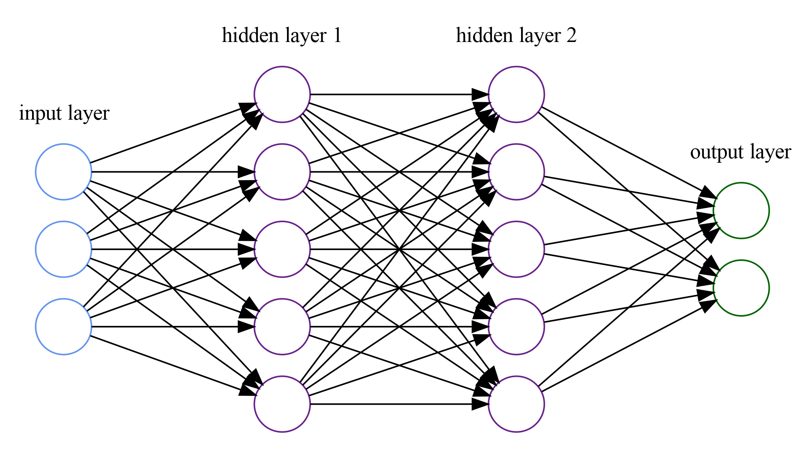

# Neural Network:

A fully connected neural network written in python (and numpy)




## Dependencies:
- numpy: https://numpy.org/


### Install:
pip3 install -r requirements.txt


## Use:
The Neural Network can be imported and used for classification problems   
The following activation functions are currently supported:
* Sigmoid
* ReLu
* Softmax
* Tanh
* Linear function
* Leaky ReLu
* Swish

Error functions:  
* Squared Loss
* Cross Entropy

The weights can either be randomly initialized  with the init method which takes 2 lists as input, one containing the number of neurons per layer (the number representing the input layer must be equal to the number of features of the data). The second list contains the activation functions (in string) for each layer.  
The second option is to load a model from a JSON file which can be either created by saving a model from this library or from keras (please note that this function is only valid for fully connected -dense- layers and only if the activation function is supported by this library).  


## Example:
The neural network in the picture above will be initialized like this:  
```python
net = Network()

net.init(input_dimension=3, loss_function="cross entropy", layers=[
    {"units": 5, "activation": "sigmoid", "type":"dense"},
    {"units": 5, "activation": "sigmoid", "type":"dense"},
    {"units": 2, "activation": "softmax", "type":"dense"}
])

# Activations: relu, sigmoid, softmax, tanh, linear, lrelu, swish
```

After initialization, the neural network can be trained:  
```python
net.fit( x, y, learning_rate=0.01, epochs=10, batch_size=32)

# learning_rate = learning rate, default = 0.01
# epochs = number of epochs used for training, default = 10
# batch_size = lenght of each mini batch, default = 32
```

And finally, predictions can be made:
```python
y_pred = net.predict(x_test)
```
